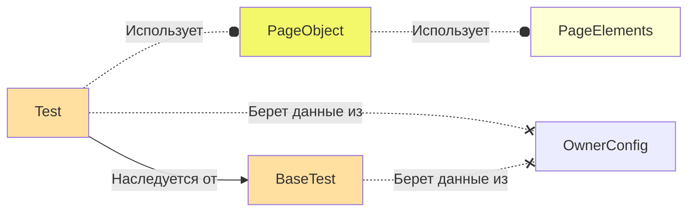

<h1 align="center">Привет! Меня зовут Никита
</h1>
<h3 align="center">Я работаю инженером по автоматизации тестирования с 2018 года</h3>

### Cтек технологий

### Образование

 <table width="100%" cellspacing="0" cellpadding="5">
    <tr >
        <td align="center"></td>
        <td>Школа инженеров по автоматизации тестирования QA.GURU.</td>
        <td>2022</td>
    </tr>
    <tr>
        <td align="center">
            
        </td>
        <td>
            НИУ "Высшая школа экономики".
          <b>Программная инженерия.</b>
        </td>
        <td>2018 - 2022</td>
    </tr>
    <tr>
        <td align="center">
            
        </td>
        <td>
            Академическая школа информационных технологий.
          <b>Программирование в компьютерных системах.</b>
        </td>
        <td>2015 - 2018</td>
    </tr>
</table>

<h2>Примеры работ:</h2>
<h3>Тесты для Pikabu</h3>
https://github.com/NikitaDanshin415/PikabuTests
<h2><a name='projectStack'>:cookie:Стек проекта:</a></h2>

    
    
    
    
    
    
    
    

<ul>
	<li>Java - используется как основной язык для написания тестов</li>
	<li>Gradle - используется для сборки проекта</li>
	<li>Junit5 - тестовый фремворк</li>
	<li>Selenide - библиотека для работы с UI элементами страницы</li>
	<li>Allure - для формирования отчетов</li>
	<li>Jenkins - используется для запуска тестов</li>
	<li>Selenoid - используется для создания контейнеров для прохождения тестов</li>
	<li>AllureTestOps - система управления тестовыми сценариями</li>
</ul>

<h2>:cookie:<a name='projectArchitecture'>Архитектура проекта</a></h2>
Архитектура проекта состоит из 5 основных модулей
<ol>
    <li>
        <b>OwnerConfig</b> - конфигурационные файлы проекта, в которых может содержаться информация о среде выполнения теста и данные необходимые для работы теста.
        Данные для конфига берутся из .properties файла в ресурсах проекта, а так же из параметров запущенного теста.
    </li>
    <li>
        <b>BaseTest</b> - базовый класс с конфигурацией от которого наследуются все классы с тестами. Содержит методы BeforeEach и AfterEach.
    </li>
    <li>
        <b>Test</b> - класс описывающий логику работы теста основываясь на бизнесс требованиях.
    </li>
    <li>
        <b>PageObjects</b> - класс для описания страницы приложения. Поля класса объявляются как приватные константы и описывают селекторы для необходимых элементов.
        Взаимодействие с классом происходит за счет публичных методов класса, использующих ранее описанные селекторы.
    </li>
    <li>
        <b>PageElements</b> - класс для описания логики работы с часто используемыми элементами страницы. (ComboBox, Calendar...)
    </li>
</ol>

